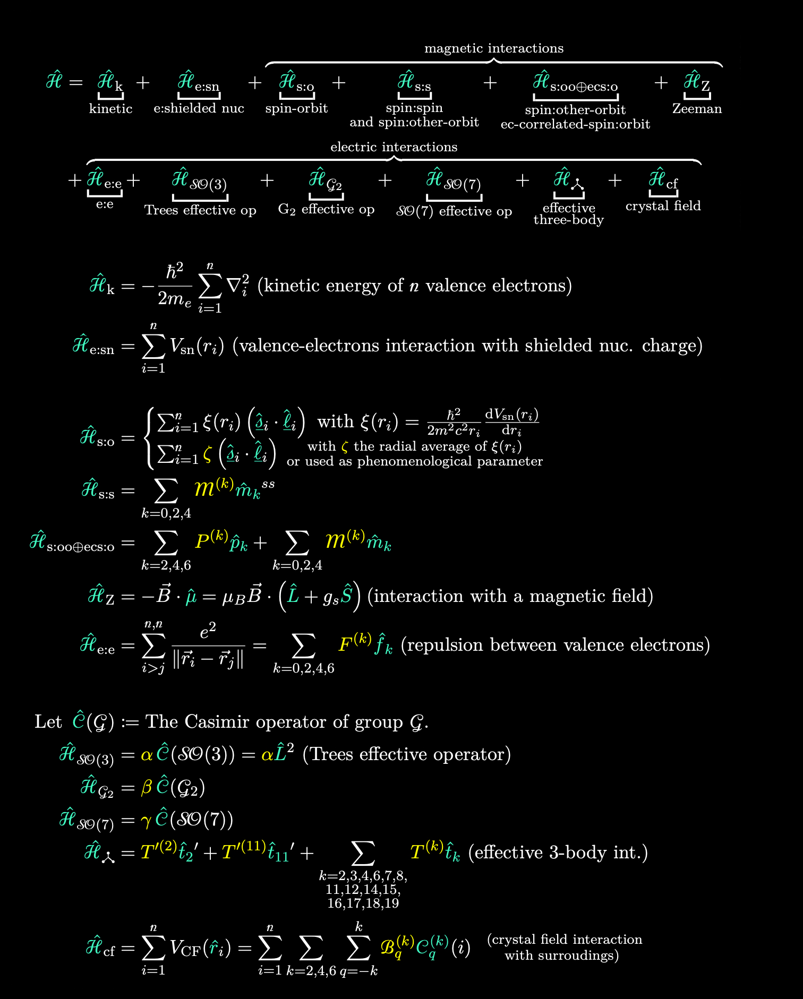
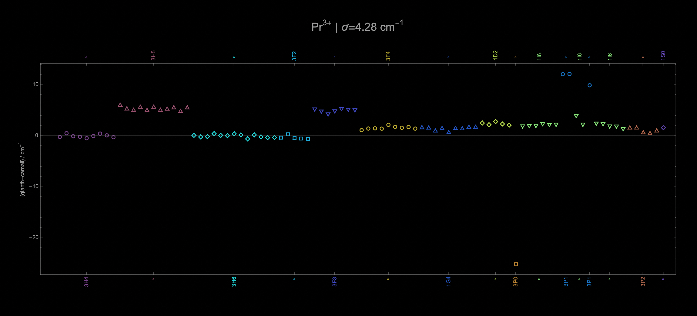
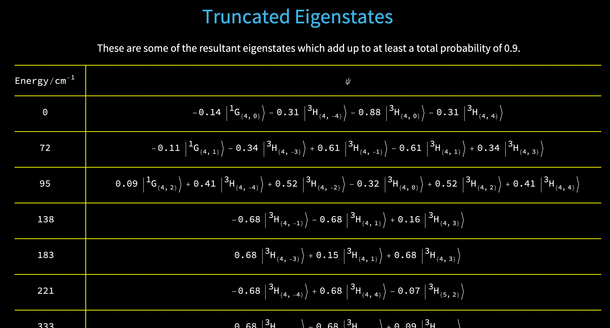

<picture>
  <source media="(prefers-color-scheme: dark)" srcset="./figs/banner-dark.png">
  <source media="(prefers-color-scheme: light)" srcset="./figs/banner-light.png">
  
</picture>

`qlanth` is a Mathematica package that can be used to calculate the level structure of lanthanide ions embedded in crystals. For this purpose it uses a single configuration description (with configuration-interaction corrections) with the effective Hamiltonian shown below. This Hamiltonian aims to describe the observed properties of ions embedded in solids in a picture that imagines them as free-ions but modified by the influence of the lattice in which they find themselves in.

<picture>
  <source media="(prefers-color-scheme: dark)" srcset="./figs/hamiltonian-dark.png">
  <source media="(prefers-color-scheme: light)" srcset="./figs/hamiltonian-light.png">
  
</picture>

This picture is one that developed and mostly matured in the second half of the last century from the efforts of Brian Judd, Hannah Crosswhite, Michael Reid, Bill Carnall, Brian Wybourne, Katherine Rajnak, and others. The goal of this code is to provide a modern implementation of the calculations that resulted from their work, with the aim of fixing some small errors that might have been included at the time these calculations were made. It also aims to provide useful electronic versions of the data these Hamiltonians may produce, including energies and eigenvectors.

`qlanth` also includes data that might be of use to those interested in the single-configuration description of lanthanide ions, independent of their specific use in this code. These data include the coefficients of fractional parentage (as calculated by Velkov and parsed here), and reduced matrix elements for all the operators listed above in the effective Hamiltonian. These are provided as standard Mathematica associations that should be simple to use elsewhere.

The included Mathematica notebook `qlanth.nb` has examples of the functions included in this package. The `/examples` folder includes notebooks for several of the trivalent lanthanide ions in LaF3, showing also comparisons against the published results of Carnall. LaF3 (lanthanum trifluoride) is remarkable in that it was one of the systems in which a systematic study <a href="https://pubs.aip.org/aip/jcp/article-abstract/90/7/3443/220581"> [Carnall (1989)] </a> of most of the trivalent lanthanide ions were studied.

There is also a documentation document ([qlanth.pdf](https://github.com/zia-lab/qlanth/blob/main/doc/qlanth.pdf)) that contains additional theoretical and practical details.

The folder `/pyql` includes Python versions of the symbolic arrays that represent the semi-empirical Hamiltonian in the different f configurations.

<picture>
  <source media="(prefers-color-scheme: dark)" srcset="./figs/Pr3plus-diffs-dark.png">
  <source media="(prefers-color-scheme: light)" srcset="./figs/Pr3plus-diffs-light.png">
  
</picture>

<picture>
  <source media="(prefers-color-scheme: dark)" srcset="./figs/pr3plus-states-dark.png">
  <source media="(prefers-color-scheme: light)" srcset="./figs/pr3plus-states-light.png">
  
</picture>

## Installation

To install *qlanth* in Wolfram/Mathematica use the following steps:

- Download the latest <a href="https://github.com/zia-lab/qlanth/releases"> release </a> and install the paclet using <a href="https://reference.wolfram.com/language/ref/PacletInstall.html.en"> PacletInstall</a>. 
- See documentation therein. Probably going straight to `HamMatrixAssembly` and `BasisLSJMJ` are the first things to try. The first function provides the matrix representation of the Hamiltonian for f^n, and the second function provides the labels for the ordered basis in which the representation is given.

To use the Python version of the resultant symbolic arrays, see the `/pyql` folder and the included scripts.

## References

- Dodson, Christopher M., and Rashid Zia. “Magnetic Dipole and Electric Quadrupole Transitions in the Trivalent Lanthanide Series: Calculated Emission Rates and Oscillator Strengths.” Physical Review B 86, no. 12 (September 5, 2012): 125102. <a href="https://doi.org/10.1103/PhysRevB.86.125102"> 🔗 </a>
- Velkov, Dobromir. “Multi-Electron Coefficients of Fractional Parentage for the p, d, and f Shells.” John Hopkins University, 2000.  <a href="https://www.proquest.com/docview/304605104"> 🔗 </a>
- Nielson, C. W., and George F Koster. "Spectroscopic Coefficients for the pn, dn, and fn Configurations, 1963. <a href="https://archive.org/details/Spectrosco_00_Niel"> 🔗 </a>
- Wybourne, Brian. "Spectroscopic Properties of Rare Earths", 1965.
- Hansen, JE, BR Judd, and Hannah Crosswhite. “Matrix Elements of Scalar Three-Electron Operators for the Atomic f-Shell.” Atomic Data and Nuclear Data Tables 62, no. 1 (1996): 1–49. <a href="https://www.sciencedirect.com/science/article/pii/S0092640X96900017"> 🔗 </a>
- Carnall, W. T., G. L. Goodman, K. Rajnak, and R. S. Rana. “A Systematic Analysis of the Spectra of the Lanthanides Doped into Single Crystal LaF3.” The Journal of Chemical Physics 90, no. 7 (1989): 3443–57. <a href="https://pubs.aip.org/aip/jcp/article-abstract/90/7/3443/220581"> 🔗 </a>

## Acknowledgements

- This code was originally authored by Christopher Dodson and Rashid Zia, and was rewritten and expanded by David Lizarazo at Brown University. It has also benefited from the helpful discussions with Tharnier Puel at the University of Iowa.

- qlanth was developed under a collaboration between  the  groups  of  Dr.  Rashid  Zia  at  Brown University,  the Quantum Engineering Laboratory at the University of Pennsylvania  led  by  Dr. Lee Bassett, and the group of Dr. Michael Flatté at the University of Iowa.

- This work is supported by the National Science Foundation Grant No. DMR-1922025.
