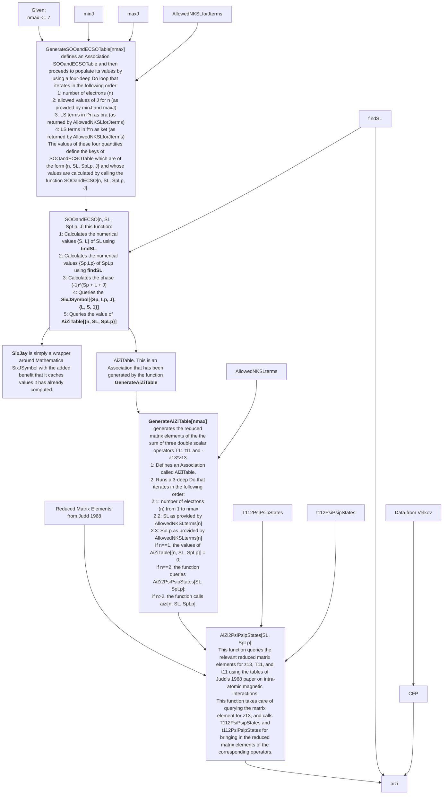

```mermaid
flowchart TB

Start["Given:
nmax <= 7"]

Start --> GenerateSOOandECSOTable["`GenerateSOOandECSOTable[nmax] defines an Association SOOandECSOTable and then proceeds to populate its values by using a four-deep Do loop that iterates in the following order:

1: number of electrons (n) 
2: allowed values of J for n (as provided by minJ and maxJ)
3: LS terms in f^n as bra (as returned by AllowedNKSLforJterms)
4: LS terms in f^n as ket (as returned by AllowedNKSLforJterms)

The values of these four quantities define the keys of SOOandECSOTable which are of the form {n, SL, SpLp, J} and whose values are calculated by calling the function SOOandECSO[n, SL, SpLp, J].`"]

minJ["minJ"] --> GenerateSOOandECSOTable

maxJ["maxJ"] --> GenerateSOOandECSOTable

AllowedNKSLforJterms["AllowedNKSLforJterms"]  --> GenerateSOOandECSOTable

GenerateSOOandECSOTable --> SOOandECSO["`SOOandECSO[n, SL, SpLp, J] this function:
1: Calculates the numerical values {S, L} of SL using **findSL**.
2: Calculates the numerical values {Sp,Lp} of SpLp using **findSL**.
3: Calculates the phase (-1)^(Sp + L + J)
4: Queries the **SixJSymbol[{Sp, Lp, J}, {L, S, 1}]**
5: Queries the value of **AiZiTable[{n, SL, SpLp}]**
`"]

findSL["findSL"] --> SOOandECSO

SOOandECSO --> SixJay["`**SixJay** is simply a wrapper around Mathematica SixJSymbol with the added benefit that it caches values it has already computed.`"]

SOOandECSO --> AiZiTable["`AiZiTable. This is an Association that has been generated by the function **GenerateAiZiTable**`"]

AiZiTable --> GenerateAiZiTable["`**GenerateAiZiTable[nmax]** generates the reduced matrix elements of the the sum of three double scalar operators T11 t11 and -a13*z13.

1: Defines an Association called AiZiTable.
2: Runs a 3-deep Do that iterates in the following order:
2.1: number of electrons (n) from 1 to nmax
2.2: SL as provided by AllowedNKSLterms[n]
2.3: SpLp as provided by AllowedNKSLterms[n]

If n==1, the values of AiZiTable[{n, SL, SpLp}] = 0;
if n==2, the function queries AiZi2PsiPsipStates[SL, SpLp];
if n>2, the function calls aizi[n, SL, SpLp]. 
`"]

RedMatElementsFromJudd["Reduced Matrix Elements from Judd 1968"] --> AiZi2PsiPsipStates;

AiZi2PsiPsipStates --> aizi

GenerateAiZiTable --> AiZi2PsiPsipStates["`AiZi2PsiPsipStates[SL, SpLp]:
This function queries the relevant reduced matrix elements for z13, T11, and t11 using the tables of Judd's 1968 paper on intra-atomic magnetic interactions.

This function takes care of querying the matrix element for z13, and calls T112PsiPsipStates and t112PsiPsipStates for bringing in the reduced matrix elements of the corresponding operators.
`"]

T112PsiPsipStates --> AiZi2PsiPsipStates

t112PsiPsipStates --> AiZi2PsiPsipStates

findSL --> aizi

DataFromVelkov["Data from Velkov"] --> CFP

CFP --> aizi

AllowedNKSLterms["AllowedNKSLterms"] --> GenerateAiZiTable

```