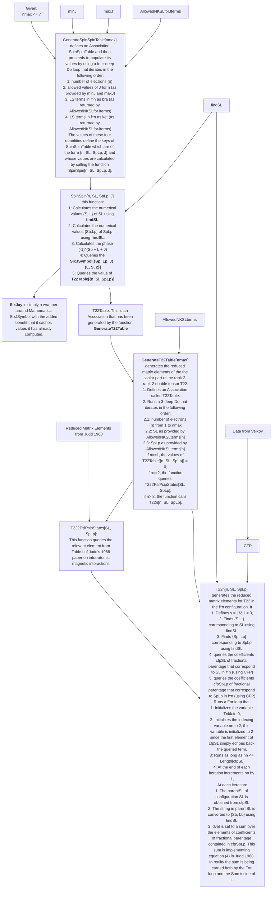

```mermaid
flowchart TB

Start["Given:
nmax <= 7"]

Start --> GenerateSpinSpinTable["`GenerateSpinSpinTable[nmax] defines an Association SpinSpinTable and then proceeds to populate its values by using a four-deep Do loop that iterates in the following order:

1: number of electrons (n) 
2: allowed values of J for n (as provided by minJ and maxJ)
3: LS terms in f^n as bra (as returned by AllowedNKSLforJterms)
4: LS terms in f^n as ket (as returned by AllowedNKSLforJterms)

The values of these four quantities define the keys of SpinSpinTable which are of the form {n, SL, SpLp, J} and whose values are calculated by calling the function SpinSpin[n, SL, SpLp, J].`"]

minJ["minJ"] --> GenerateSpinSpinTable

maxJ["maxJ"] --> GenerateSpinSpinTable

AllowedNKSLforJterms["AllowedNKSLforJterms"]  --> GenerateSpinSpinTable

GenerateSpinSpinTable --> SpinSpin["`SpinSpin[n, SL, SpLp, J] this function:
1: Calculates the numerical values {S, L} of SL using **findSL**.
2: Calculates the numerical values {Sp,Lp} of SpLp using **findSL**.
3: Calculates the phase (-1)^(Sp + L + J)
4: Queries the **SixJSymbol[{Sp, Lp, J}, {L, S, 2}]**
5: Queries the value of **T22Table[{n, Sl, SpLp}]**
`"]

findSL["findSL"] --> SpinSpin

SpinSpin --> SixJay["`**SixJay** is simply a wrapper around Mathematica SixJSymbol with the added benefit that it caches values it has already computed.`"]

SpinSpin --> T22Table["`T22Table. This is an Association that has been generated by the function **GenerateT22Table**`"]

T22Table --> GenerateT22Table["`**GenerateT22Table[nmax]** generates the reduced matrix elements of the the scalar part of the rank-2, rank-2 double tensor T22.

1: Defines an Association called T22Table.
2: Runs a 3-deep Do that iterates in the following order:
2.1: number of electrons (n) from 1 to nmax
2.2: SL as provided by AllowedNKSLterms[n]
2.3: SpLp as provided by AllowedNKSLterms[n]

If n==1, the values of T22Table[{n, SL, SpLp}] = 0;
if n==2, the function queries T222PsiPsipStates[SL, SpLp];
if n> 2, the function calls T22n[n, SL, SpLp]. 
`"]

RedMatElementsFromJudd["Reduced Matrix Elements from Judd 1968"] --> T222PsiPsipStates;


T222PsiPsipStates --> T22n

GenerateT22Table --> T222PsiPsipStates["`T222PsiPsipStates[SL, SpLp]:
This function queries the relevant element from Table I of Judd's 1968 paper on intra-atomic magnetic interactions.`"]

GenerateT22Table --> T22n["`T22n[n, SL, SpLp] generates the reduced matrix elements for T22 in the f^n configuration. It

1: Defines s = 1/2, l = 3,
2: Finds {S, L} corresponding to SL using findSL,
3: Finds {Sp, Lp} corresponding to SpLp using findSL,
4: queries the coefficients cfpSL of fractional parentage that correspond to SL in f^n (using CFP)
5: queries the coefficients cfpSpLp of fractional parentage that correspond to SpLp in f^n (using CFP)

Runs a For loop that:

1: Initializes the variable Tnkk to 0,
2: Initializes the indexing variable nn to 2; this variable is initialized to 2 since the first element of cfpSL simply echoes back the queried term,
3: Runs as long as nn <= Length[cfpSL]
4: At the end of each iteration increments nn by 1,

At each iteration:

1: The parentSL of configuration SL is obtained from cfpSL.
2: The string in parentSL is converted to {Sb, Lb} using findSL.
3: dval is set to a sum over the elements of coefficients of fractional parentage contained in cfpSpLp. This sum is implementing equation (4) in Judd 1968. In reality the sum is being carried both by the For loop and the Sum inside of it.

`"]

findSL --> T22n

DataFromVelkov["Data from Velkov"] --> CFP

CFP --> T22n

AllowedNKSLterms["AllowedNKSLterms"] --> GenerateT22Table

```